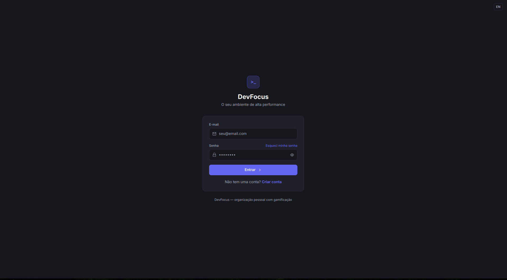
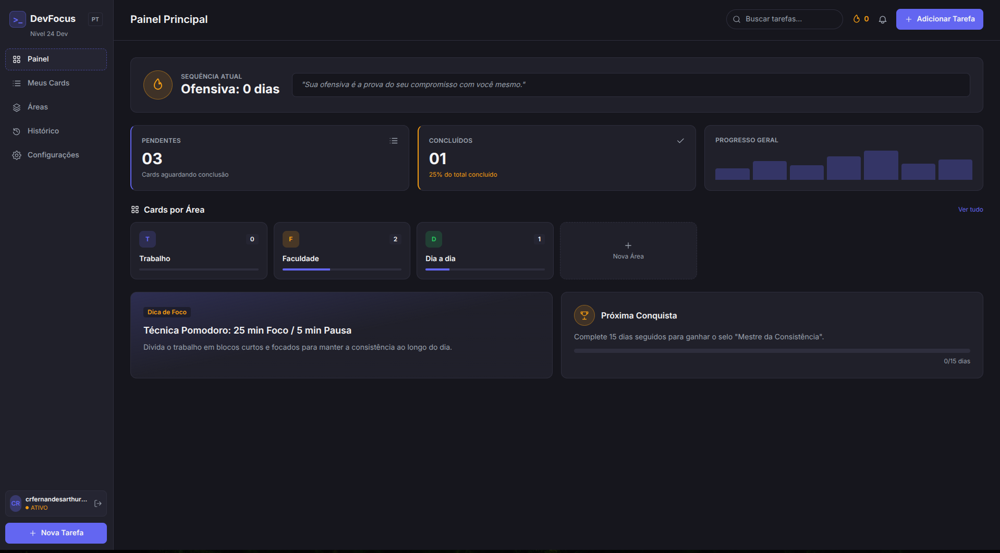
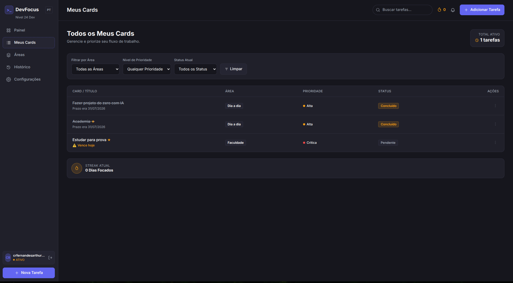
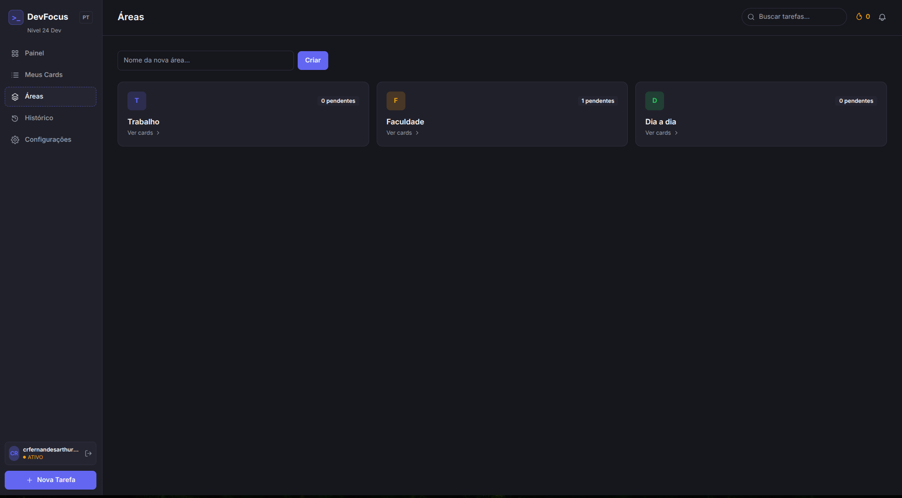
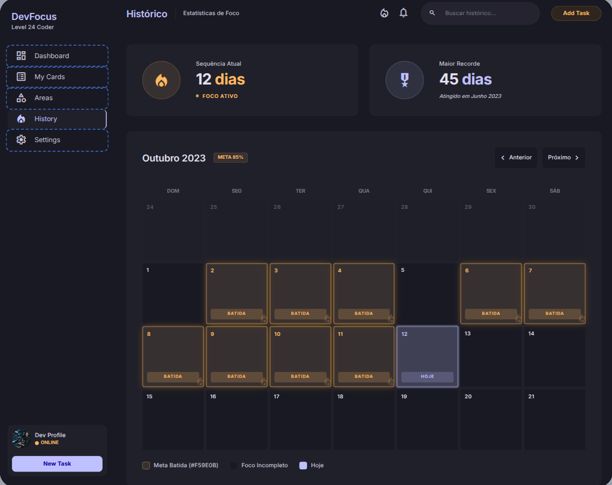
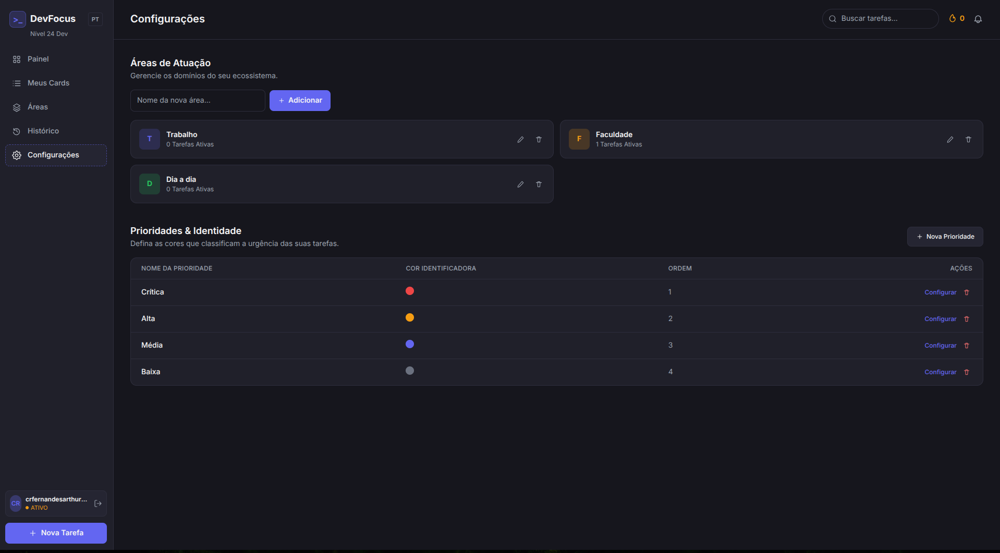
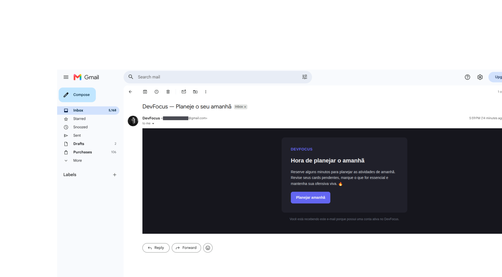

# DevFocus

Sistema pessoal de organizacao de atividades ("Jira pessoal com gamificacao"): areas, prioridades,
cards com prazo e marcacao de "essencial", ofensiva (streak) diaria estilo Duolingo, historico em
calendario e notificacoes por e-mail (lembrete diario + alerta de prazo).

## Telas

| | |
|---|---|
| **Login**  | **Painel Principal**  |
| **Meus Cards**  | **Áreas**  |
| **Histórico**  | **Configurações**  |
| **E-mail de lembrete diário**  | |

## Arquitetura

```
/services
  /cards-service         -> CRUD de areas, prioridades e cards        (porta 3001)
  /streak-service         -> ofensiva, historico, cron de meia-noite   (porta 3002)
  /notification-service   -> e-mails (lembrete diario + alerta prazo)  (porta 3003)
  /api-gateway             -> ponto unico de entrada para o frontend    (porta 3000)
/frontend                  -> Vue 3 + Vite + Tailwind                   (porta 5173)
/supabase/migrations       -> schema SQL + RLS + seeds
```

O frontend fala **apenas** com o `api-gateway` (`/api/...`) para dados de areas/prioridades/cards/
streak, e diretamente com o Supabase Auth (login/cadastro) e a tabela `frases_motivacionais`
(conteudo publico de leitura). Cada microsservico usa o JWT do usuario (repassado pelo gateway)
para consultar o Supabase respeitando as policies de RLS — nenhum servico usa `service_role` a
pedido direto do frontend.

`streak-service` e `notification-service` tambem expoem rotas internas (`/internal/*` e
`/notify/*`) protegidas por um header `x-internal-key`, usadas pelos jobs agendados (cron) e nunca
roteadas pelo gateway.

## Como rodar o projeto localmente

Passo a passo completo, do zero, para deixar o DevFocus rodando na sua maquina.

### Pre-requisitos

- **Node.js 18 ou superior** (`node -v` para conferir) e **npm** (vem junto com o Node)
- **git**
- Uma conta gratuita no **[Supabase](https://supabase.com)** — e o unico servico externo que o
  projeto depende para funcionar (banco de dados + autenticacao)
- Opcional: uma conta de e-mail com **senha de app** (Gmail, por exemplo) se voce quiser testar o
  envio real de e-mails. Sem isso o sistema funciona normalmente, so que os e-mails ficam
  "simulados" (aparecem no log do terminal em vez de caírem numa caixa de entrada de verdade)

### Passo 1 — Clonar o repositorio

```bash
git clone https://github.com/artfrc/dev-focus.git
cd dev-focus
```

### Passo 2 — Criar e configurar o projeto no Supabase

O Supabase e' o unico "servidor externo" que o projeto usa — ele fornece o banco de dados
(Postgres) e a autenticacao por e-mail/senha. Tudo o resto (os 4 microsservicos e o frontend) roda
na sua maquina.

1. Va em https://supabase.com, crie uma conta (se ainda nao tiver) e clique em **New Project**.
   Escolha um nome, uma senha para o banco (guarde essa senha em um lugar seguro — o Supabase nao
   mostra ela de novo depois) e a regiao mais proxima de voce.
2. Espere o projeto terminar de provisionar (leva 1-2 minutos).
3. Va em **SQL Editor** (menu lateral) → **New query**, cole todo o conteudo do arquivo
   [`supabase/migrations/20260101000000_init_schema.sql`](supabase/migrations/20260101000000_init_schema.sql)
   deste repositorio e clique em **Run**.
   - Isso cria todas as tabelas (`areas`, `prioridades`, `cards`, `streak`, `streak_historico`,
     `frases_motivacionais`), habilita o RLS (Row Level Security — garante que cada usuario so
     enxerga os proprios dados), cadastra as policies de acesso, popula as frases motivacionais
     padrao e cria um trigger que, automaticamente, cria as areas/prioridades padrao (Trabalho,
     Faculdade, Dia a dia + 4 niveis de prioridade) e a linha inicial de `streak` para **cada
     usuario novo que se cadastrar**.
   - Se aparecer "Success. No rows returned", deu tudo certo.
4. Va em **Authentication → Providers** e confirme que o provider **Email** esta habilitado (ele ja
   vem habilitado por padrao na maioria dos projetos novos).
5. Va em **Settings → API** (ou **Settings → API Keys**, dependendo da versao do dashboard) e
   anote 3 valores que voce vai usar no proximo passo:
   - **Project URL** (algo como `https://xxxxxxxx.supabase.co`)
   - **anon public key** (uma chave JWT longa, comeca com `eyJ...`) — essa e' segura para expor no
     frontend, e' feita pra isso
   - **service_role key** (**outra chave JWT, tambem comeca com `eyJ...`, porem SECRETA** — ela
     ignora as regras de RLS e da acesso total ao banco. Nunca vai no frontend, nunca vai pro git.
     So e' usada pelos jobs internos do `streak-service` e do `notification-service`)

### Passo 3 — Configurar as variaveis de ambiente

Cada servico tem seu proprio `.env.example` (modelo, seguro de versionar) que voce copia para um
`.env` (arquivo real, com segredos, **nunca commitado** — ja esta no `.gitignore`).

```bash
cp frontend/.env.example frontend/.env
cp services/cards-service/.env.example services/cards-service/.env
cp services/streak-service/.env.example services/streak-service/.env
cp services/notification-service/.env.example services/notification-service/.env
cp services/api-gateway/.env.example services/api-gateway/.env
```

Agora abra cada `.env` criado e preencha com os valores do Passo 2:

| Arquivo | O que preencher |
|---|---|
| `frontend/.env` | `VITE_SUPABASE_URL` (Project URL) e `VITE_SUPABASE_ANON_KEY` (anon public key). `VITE_API_GATEWAY_URL` pode ficar como esta (`http://localhost:3000/api`) |
| `services/cards-service/.env` | `SUPABASE_URL` e `SUPABASE_ANON_KEY` (os mesmos dois valores acima) |
| `services/streak-service/.env` | `SUPABASE_URL`, `SUPABASE_ANON_KEY` **e** `SUPABASE_SERVICE_ROLE_KEY` (a chave secreta) |
| `services/notification-service/.env` | `SUPABASE_URL`, `SUPABASE_SERVICE_ROLE_KEY` e, se quiser e-mails de verdade, as variaveis `SMTP_*` (veja abaixo) |
| `services/api-gateway/.env` | nao precisa mexer — ja vem com as portas locais corretas |

Alem disso, defina um valor qualquer (uma string aleatoria) para `INTERNAL_API_KEY` em
`services/streak-service/.env` **e** em `services/notification-service/.env` — mas **use o mesmo
valor nos dois arquivos**. Essa chave protege as rotas internas (`/internal/*`, `/notify/*`) que
so devem ser chamadas pelos proprios jobs agendados, nunca pelo frontend.

**E-mail (opcional):** para receber e-mails de verdade (lembrete diario / alerta de prazo) em vez
de so ver o log simulado no console, preencha `SMTP_USER` e `SMTP_PASS` em
`services/notification-service/.env`. Com Gmail: ative a verificacao em duas etapas na sua conta
Google, gere uma **senha de app** em https://myaccount.google.com/apppasswords e use ela (nao a
sua senha normal) em `SMTP_PASS`.

### Passo 4 — Instalar as dependencias

O repositorio usa **npm workspaces**, entao um unico `npm install` na raiz instala tudo (os 4
microsservicos + o frontend) de uma vez:

```bash
npm install
```

### Passo 5 — Rodar tudo

```bash
npm run dev
```

Esse comando sobe os 5 processos ao mesmo tempo (gateway, cards, streak, notify, frontend) num
unico terminal, com logs coloridos e prefixados por servico (`[gateway]`, `[cards]`, `[streak]`,
`[notify]`, `[frontend]`). `Ctrl+C` derruba tudo de uma vez.

Voce deve ver algo parecido com isto quando estiver tudo no ar:

```
[gateway] api-gateway rodando na porta 3000
[cards] cards-service rodando na porta 3001
[streak] streak-service rodando na porta 3002
[notify] notification-service rodando na porta 3003
[frontend]   VITE ready in xxx ms
[frontend]   ➜  Local:   http://localhost:5173/
```

> Se voce rodar `npm install` de novo enquanto o `npm run dev` ja estiver de pe, o `--watch` dos
> servicos pode detectar a mudanca no `node_modules` e tentar reiniciar em cima da porta ainda
> ocupada (aparece um `EADDRINUSE` passageiro nos logs). Pare o `npm run dev` (`Ctrl+C`) antes de
> instalar algo novo, e suba de novo depois.

Se preferir cada servico no seu proprio terminal (util para reiniciar um so sem derrubar os
outros, ou pra ver os logs de cada um isolados):

```bash
npm run dev:gateway        # http://localhost:3000
npm run dev:cards          # http://localhost:3001
npm run dev:streak         # http://localhost:3002
npm run dev:notifications  # http://localhost:3003
npm run dev:frontend       # http://localhost:5173
```

### Passo 6 — Acessar e criar sua conta

Abra **http://localhost:5173** no navegador. Na tela de login, clique em **Criar conta**, informe
um e-mail e uma senha (minimo 6 caracteres) e envie.

- Se a confirmacao por e-mail estiver **desabilitada** no seu projeto Supabase (padrao para
  projetos novos em modo de teste), voce ja entra direto no painel.
- Se estiver **habilitada**, o Supabase manda um e-mail de confirmacao para o endereco informado —
  confirme por la antes de conseguir logar. (Da pra desabilitar em **Authentication → Providers
  → Email → Confirm email**, se quiser pular essa etapa durante o desenvolvimento.)

Assim que voce loga pela primeira vez, o trigger do banco (criado no Passo 2) ja gera
automaticamente suas 3 areas padrao, as 4 prioridades padrao e sua ofensiva zerada — o painel
principal deve aparecer populado, pronto pra criar o primeiro card.

### Problemas comuns

| Sintoma | Causa provavel |
|---|---|
| `Token de autenticação ausente` / `401` ao usar o app | `.env` do frontend ou de algum servico com `SUPABASE_URL`/`SUPABASE_ANON_KEY` errados ou vazios |
| `EADDRINUSE` ao rodar `npm run dev` | Alguma porta (3000-3003 ou 5173) ja esta em uso por outro processo — encontre com `lsof -i :3001` (troque a porta) e finalize, ou rode `npm install` **antes** de subir os servicos, nao depois |
| E-mails nao chegam | Sem `SMTP_USER`/`SMTP_PASS` preenchidos, o envio e' so simulado (aparece no log do terminal, nao chega em lugar nenhum de verdade) — isso e' esperado |
| Cadastro nao "entra" direto no painel | Confirmacao de e-mail habilitada no Supabase — confirme pelo e-mail recebido ou desabilite em Authentication → Providers |
| Áreas/prioridades nao aparecem para um usuario existente | O trigger so roda no **cadastro** do usuario; ele nao retroage para contas criadas antes de aplicar a migration |

## Jobs agendados (cron)

- **streak-service**: todo dia as `00:05` (fuso `TZ` do `.env`) recalcula a ofensiva do dia
  anterior para todos os usuarios (`recalcularOfensivaTodos`), verificando se os cards essenciais
  com prazo naquele dia foram todos concluidos. O endpoint interno `POST /internal/recalcular`
  (protegido por `x-internal-key`) tambem pode ser chamado manualmente para backfill/depuracao,
  aceitando `{ data?: 'YYYY-MM-DD', user_id?: 'uuid' }`.
- **notification-service**: `CRON_LEMBRETE_DIARIO` (padrao `0 20 * * *`) dispara o lembrete diario
  de planejamento; `CRON_VERIFICAR_PRAZOS` (padrao `0 8 * * *`) envia o alerta para cards pendentes
  a 7 dias ou menos do prazo. Os mesmos disparos existem como endpoints internos
  (`POST /notify/lembrete-diario`, `POST /notify/verificar-prazos`) para execucao sob demanda.
- Sem SMTP configurado, o `notification-service` apenas loga o e-mail simulado no console — util
  para desenvolvimento local sem depender de credenciais reais.

## Regra da ofensiva (streak)

Para uma data `D`: pega todos os cards `essencial = true` com `prazo = D`. Se nenhum estiver
`pendente` (inclui o caso de nao existir nenhum essencial nesse dia), a meta foi batida. O
`sequencia_atual` e recalculado contando dias consecutivos com meta batida terminando em `D`
(olhando `streak_historico`), e `maior_sequencia` guarda o maior valor ja atingido — essa
abordagem e idempotente, entao rodar o job mais de uma vez para o mesmo dia nao corrompe o
contador.

## Autenticacao no frontend

- `src/lib/supabase.js` cria o client do Supabase (email/senha).
- `src/router/index.js` tem um guard global: rotas sem `meta.public` exigem sessao ativa e
  redirecionam para `/login` caso contrario.
- `src/lib/api.js` injeta automaticamente o `access_token` da sessao atual como
  `Authorization: Bearer <jwt>` em toda chamada ao `api-gateway`.
